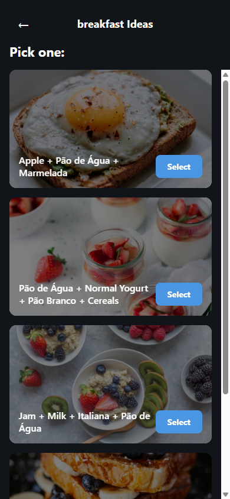

<div align="center">
  
  <h1>SaborSpin</h1>
  <p><strong>Shake up your plate</strong> - Variety-enforced meal suggestions</p>

  [](./LICENSE)
  [](./CONTRIBUTING.md)
</div>

---

## What is SaborSpin?

SaborSpin helps you decide what to eat without repeating meals too often. Get personalized meal suggestions based on your ingredients and eating history.

**Problem:** Decision fatigue around daily meals. Eating the same things repeatedly.

**Solution:** Variety-enforced meal suggestions that prevent repetition while respecting your preferences.

**Website:** [saborspin.com](https://saborspin.com)

---

## Features

- **Variety Enforced** - Algorithm prevents repeating ingredients within your cooldown period
- **Fast Decisions** - Pick a meal in under 20 seconds
- **Fully Customizable** - Add your own ingredients, categories, and meal types
- **Meal Tracking** - See your eating history and patterns
- **Dark Mode** - Easy on the eyes, day or night
- **Privacy First** - All data stored locally, no cloud sync
- **Cross-Platform** - iOS, Android, and Web

---

## Screenshots

<div align="center">
  
</div>

---

## Download

### Android
- Download APK from [Releases](https://github.com/vitorsilva/saborspin/releases)
- Coming soon to Google Play Store

### iOS
Coming soon to the App Store

### Web
Try the web version (data not persisted) by running locally.

---

## Quick Start for Developers

```bash
# Clone the repo
git clone https://github.com/vitorsilva/saborspin.git
cd saborspin/demo-react-native-app

# Install dependencies
npm install

# Start development server
npm start

# Run tests
npm test

# Run E2E tests
npm run test:e2e
```

See [Installation Guide](./docs/developer-guide/INSTALLATION.md) for detailed setup.

---

## Built With

| Technology | Purpose |
|------------|---------|
| [React Native](https://reactnative.dev) + [Expo](https://expo.dev) | Mobile framework |
| [SQLite](https://www.sqlite.org) | Local-first database |
| [Zustand](https://zustand.pmnd.rs) | State management |
| [TypeScript](https://www.typescriptlang.org) | Type safety |
| [Playwright](https://playwright.dev) | E2E testing |

---

## Documentation

| Document | Description |
|----------|-------------|
| [User Guide](./docs/user-guide/) | How to use SaborSpin |
| [Architecture](./docs/architecture/) | Technical documentation |
| [Developer Guide](./docs/developer-guide/) | Setup and development |
| [Contributing](./CONTRIBUTING.md) | How to contribute |
| [Changelog](./CHANGELOG.md) | Version history |

---

## Project Status

| Epic | Status |
|------|--------|
| Epic 1: Infrastructure & Foundation | Complete |
| Epic 2: Meals Randomizer Features | Complete |
| Epic 3: Production Readiness | Complete |

**Test Coverage:** 101+ unit tests, 12 E2E tests

---

## Contributing

Contributions are welcome! Please read our [Contributing Guide](./CONTRIBUTING.md) and [Code of Conduct](./CODE_OF_CONDUCT.md).

---

## Brand

- **Name:** SaborSpin (sabor = flavor in Portuguese)
- **Tagline:** "Shake up your plate"
- **Colors:** Orange #FF6B35 | Green #4CAF50 | Yellow #FFC107

---

## License

This project is licensed under the MIT License - see the [LICENSE](./LICENSE) file.

---

<div align="center">
  Made with care in Portugal
</div>
