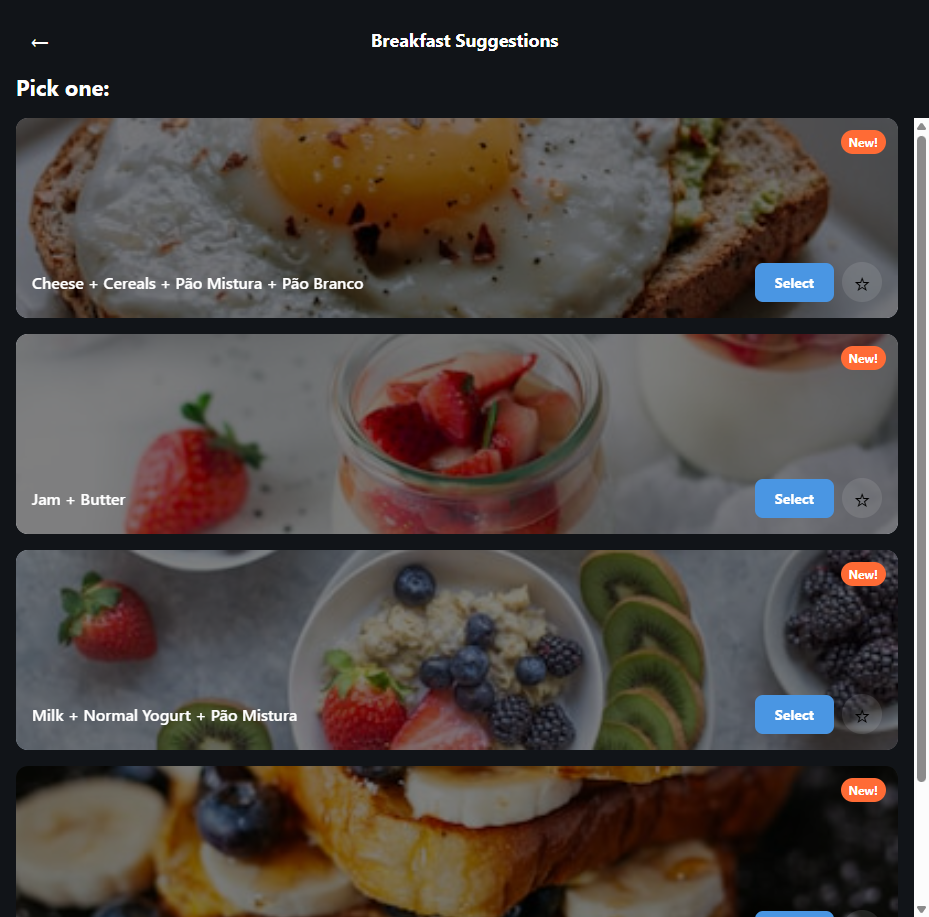
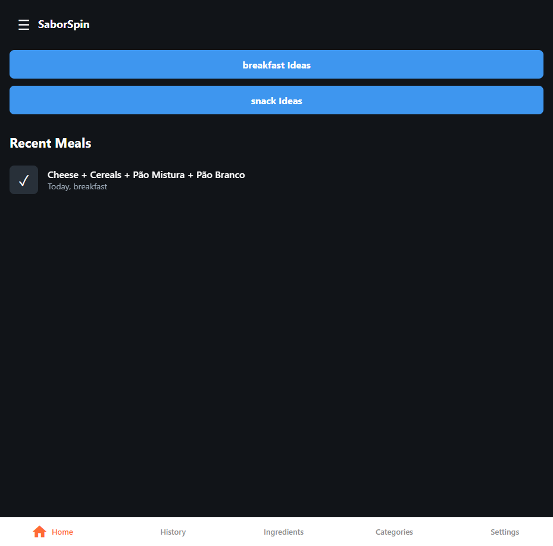

# AFTER Screenshot Documentation

## Suggestion Card - After New! Badge Implementation

### Actual Screenshot



The screenshot shows:
- **Orange "New!" badges** in the top-right corner of each card
- **Favorite toggle (☆)** next to the Select button (Feature 1.1)
- **Beautiful food images** with gradient overlay
- **Ingredient combination text** at the bottom

### Additional Screenshot: Home with Logged Meal



### Updated Suggestion Card Layout (ASCII Reference)

```
┌─────────────────────────────────────┐
│                              [New!] │  ← Orange pill badge (top-right)
│  [Background Image]                 │     Visible when combination is "new"
│                                     │
│  ──────────────────────────────────│
│  milk + cereals     [Select]  [☆]   │
│                                     │
└─────────────────────────────────────┘
```

### New! Badge Appearance

- **Background color:** #FF6B35 (SaborSpin orange accent)
- **Text:** "New!" (English) or "Novo!" (Portuguese)
- **Font:** 12px, bold, white (#FFFFFF)
- **Shape:** Pill with border-radius: 12px
- **Position:** Absolute, top: 12px, right: 12px within the card

### Badge Visibility Logic

The badge appears when:
1. **Never logged:** Combination has never been selected before
2. **Stale (7+ days):** Combination was last logged 7 or more days ago

The badge does NOT appear when:
- Combination was logged within the last 6 days

### Implementation Files

**New Files Created:**
- `components/NewBadge.tsx` - Badge component with i18n support
- `lib/utils/variety.ts` - `isNewCombination()` utility function
- `lib/utils/__tests__/variety.test.ts` - 13 unit tests
- `e2e/new-badge.spec.ts` - 3 E2E tests

**Modified Files:**
- `app/suggestions/[mealType].tsx` - Integrated NewBadge into suggestion cards
- `lib/i18n/locales/en/suggestions.json` - Added `newBadge: "New!"` key
- `lib/i18n/locales/pt-PT/suggestions.json` - Added `newBadge: "Novo!"` key

### Verification

- All unit tests pass (251 total)
- All E2E tests pass (32 total, 1 skipped)
- Linting passes (0 errors)

---

*Document updated: 2026-01-24*
*Screenshots captured: 2026-01-24*
