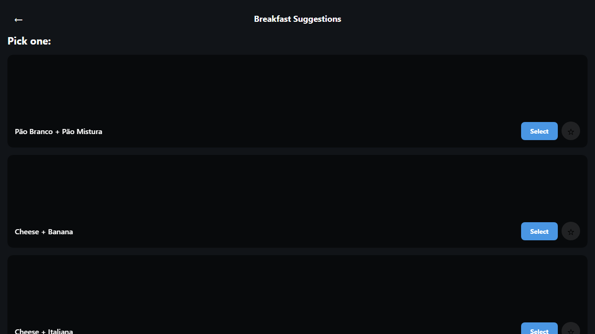
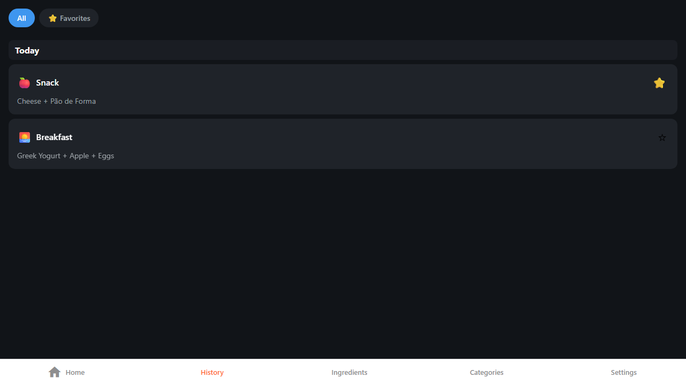
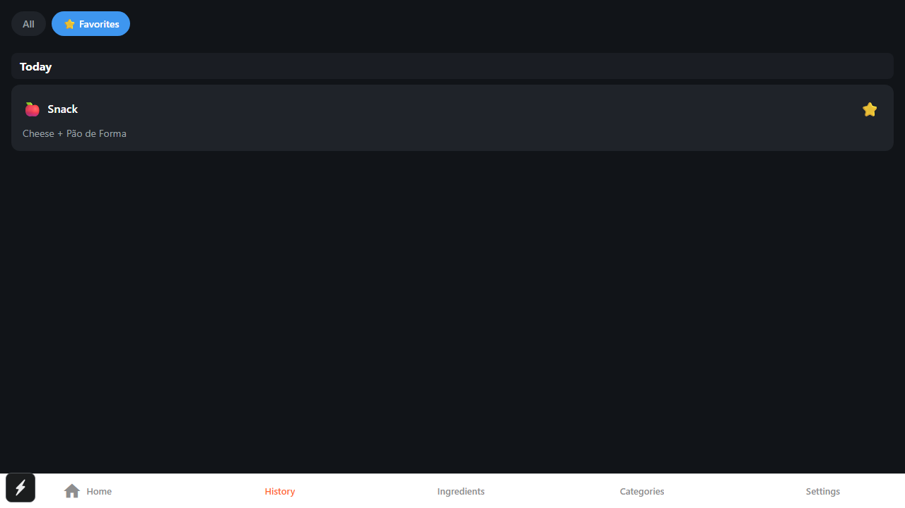
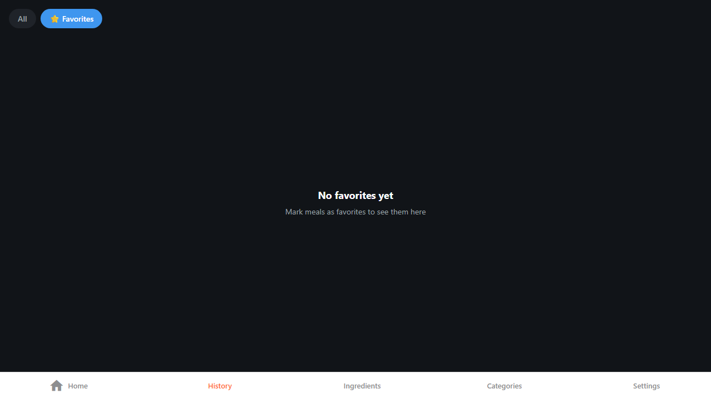

# Favorites Feature Screenshots

Screenshots captured from Feature 1.1: Favorite Combinations implementation.

## Screenshots

### 1. Suggestion Card with Favorite Button

**New UI Element:** Favorite button (☆) appears next to the "Select" button on each suggestion card.
- Tap to toggle favorite status
- ☆ = unfavorited, ⭐ = favorited
- Favorites are stored in the database

### 2. History Screen - All Filter

**New UI Elements:**
- Filter tabs at top: "All" | "⭐ Favorites"
- Favorite indicator on each history item (☆/⭐)
- "All" tab shows all logged meals regardless of favorite status

### 3. History Screen - Favorites Filter

**New UI Elements:**
- "Favorites" filter tab is highlighted (primary color)
- Only favorited meals are displayed
- Tap ⭐ icon to toggle favorite status

### 4. History Screen - Empty Favorites State

**New UI Element:** Empty state message when Favorites filter is active but no favorites exist.
- Shows helpful message to guide users
- Switching to "All" filter shows logged meals

## Date Captured
2026-01-23

## Feature Reference
- [Feature Spec](../../../../docs/learning/epic04_feature_enhancement/features/FEATURE_1.1_FAVORITES.md)
- [Progress Log](../../../../docs/learning/epic04_feature_enhancement/features/FEATURE_1.1_progress.md)
